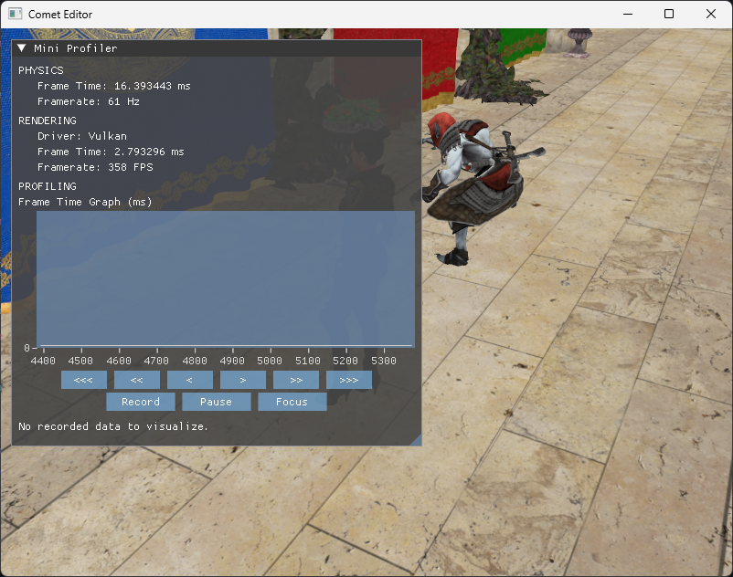
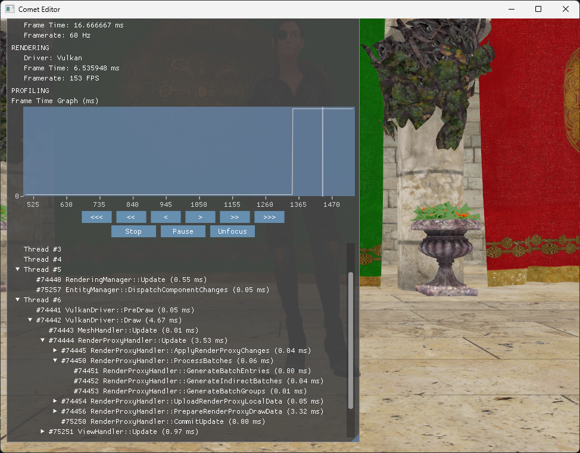
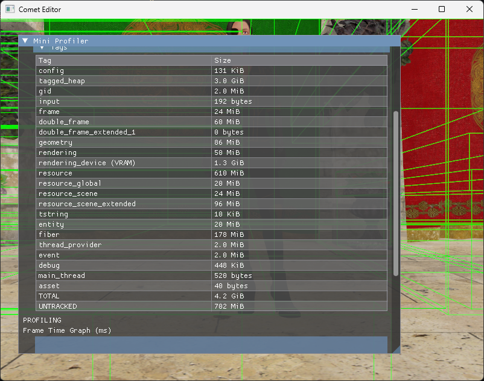

# Quick Overview

These notes summarize the main technical ideas behind **Comet**.
They're not deep documentation, just quick explanations and design generalities.

## Basic idea

**Comet** is a C++17 project following the Google Style Guide. It's a general-purpose 3D game engine built with as few external libraries as possible.
The project is split into two parts: the engine and the editor. The editor is mostly empty for now and uses a few extra libraries: it's not the focus at the moment.
Overall, the engine is still basic and experimental; it's mainly a sandbox for trying ideas rather than a finished product.

## Architecture

**Comet** is **frame-centric**, everything revolves around a single `FramePacket`.
Two `FramePacket`s are active at once: while one is rendered, the next is built by the main logic.
This model helps separate simulation from rendering cleanly and keeps the engine highly parallel.

## Job System & Memory

**Custom fiber-based job system**, inspired by [Naughty Dog's 2015 GDC talk](https://www.gdcvault.com/play/1022186/Parallelizing-the-Naughty-Dog-Engine).

* Fully custom fibers using small bits of x86 assembly for context switching (**MASM** on Windows, **GNU Assembler** (GAS) on GCC)
* Lock-free queue + fiber-aware synchronization (`FiberMutex`, `FiberCV`, etc.)
* Jobs:
  * `JobDescr` → CPU/fiber logic
  * `IOJobDescr` → file and I/O work
* Optional `COMET_FIBER_DEBUG_LABEL` for human-readable fiber job names
* Number of workers and thread setup configurable via `comet_config.cfg`

### Memory Management

* Custom `TaggedHeap` built on top of `VirtualAlloc` / `mmap`
* Tagged allocations make it easy to track subsystem usage
* Allocators:
  * Stack variants (regular, double-frame, fiber, etc.)
  * `FiberFreeListAllocator`
  * `PlatformAllocator` (wrapped `new`/`delete` for tagging)
* Temporary allocators for one/two-frame objects
* Optional debugging:
  * `COMET_TRACK_ALLOCATIONS` (per-tag memory usage)
  * `COMET_POISON_ALLOCATIONS` / `COMET_POISON_FIBER_STACKS`

## Rendering

Three rendering backends available:
* **Vulkan** (default)
* **OpenGL** (forces a main thread to work)
* **Empty** (debug-only, removes graphics noise)

Rendering is **data-driven** from the `FramePacket`, which isolates render data from engine logic: no locks between systems, just multiple buffered frames.

## Entities & ECS

Archetype-based **Entity Component System**.
Entities with identical component sets share contiguous memory → cache-friendly iteration.

* Components must be PODs
* Empty components can be used as tags
* Designed for stable component sets (adding/removing components is costly)

## Inputs

Input system built on **GLFW**, wrapped with **Comet**'s own types to stay backend-agnostic.
All input data is snapshotted once per frame into a read-only structure to ensure thread safety.

## Animations

Animation data comes from 3D models and supports skeletons/joints.
* Optional compression via `COMET_COMPRESS_ANIMATIONS` (enabled by default)
* Standard pose interpolation from keyframes
* Blending will come later

## Resources

**Assets:** raw input files (from artists/programmers *(which are also artists, don't be shy!)*).
**Resources:** engine-ready data (converted by the Editor).

* Conversion handled by the Editor
* Supported resource types: models, animations, shaders, materials, textures
* Optional **LZ4** compression

## Data Structures

Most containers accept a custom allocator implementing the `Allocator` interface.
Notable types include:
* `Array<T>` / `StaticArray<T, N>`
* `Bitset`
* `HashSet<T, HashLogic>` / `Map<Key, Value, HashLogic>`
* `StringId` (CRC32-based hashed strings)
* `TString` and `CTStringView` (UTF-8/UTF-16 aware paths)

## Events

Events derive from a base `Event` class and are dispatched via an `EventManager`.
* Can be fired immediately or next frame (preferred)
* Lifetime: two frames after dispatch
* Suitable for decoupled messaging between systems

## Configuration

Comet loads settings from a simple `comet_config.cfg` next to the executable.
Things like thread counts, renderer backend, and paths can be customized here.

## Logging

Lock-free logging system (since fibers and I/O threads can't safely sync).
* Macro format: `COMET_LOG_A_B` (e.g., `COMET_LOG_CORE_INFO`)
* Optional `COMET_LOG_IS_FIBER_PREFIX` shows which fiber/thread produced each log

## Profiling

Built-in **Dear ImGui** interface for debugging and profiling.
Requires `COMET_DEBUG` and `COMET_PROFILING`.

Modes:
* Frame metrics and CPU profiler (`COMET_IMGUI`)
* Memory tracking (`COMET_TRACK_ALLOCATIONS`)

## Notable Preprocessor Directives

| Define | Description |
|--------|-------------|
| `COMET_DEBUG` | Enables debug features |
| `COMET_PROFILING` + `COMET_IMGUI` | Enables debug UI & CPU profiler |
| `COMET_TRACK_ALLOCATIONS` | Memory tracking per tag |
| `COMET_POISON_ALLOCATIONS` / `COMET_POISON_FIBER_STACKS` | Poison memory for debugging |
| `COMET_FIBER_DEBUG_LABEL` | Names fiber jobs |
| `COMET_ALLOW_CUSTOM_MEMORY_TAG_LABELS` | Custom memory tag labels |
| `COMET_RESERVE_SYSTEM_THREADS` | Reserve 2 threads for OS |
| `COMET_COMPRESS_ANIMATIONS` | Compress animation transforms |
| `COMET_RENDERING_USE_DEBUG_LABELS` | Add debug labels visible in RenderDoc |
| `COMET_ENABLE_RENDERDOC_COMPATIBILITY` | Force main thread for RenderDoc |
| `COMET_LOG_IS_FIBER_PREFIX` | Prefix logs with fiber/thread info |
