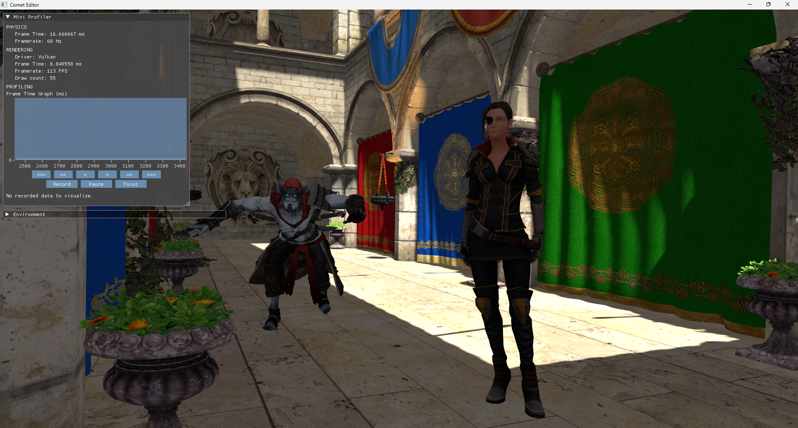
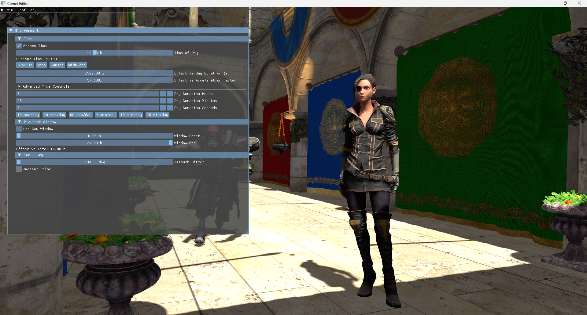
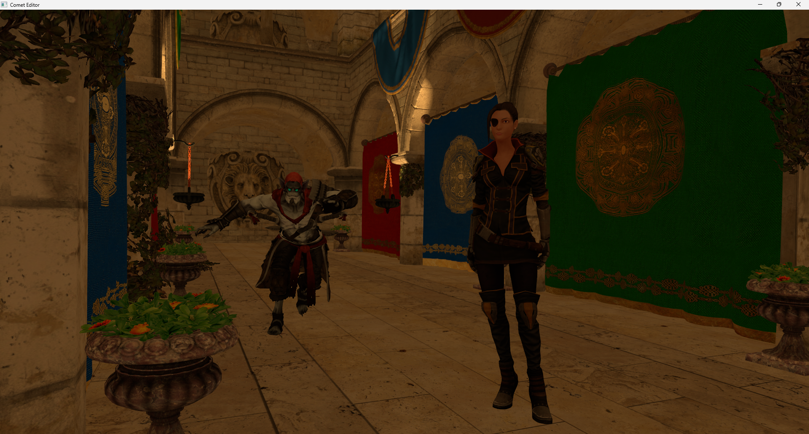
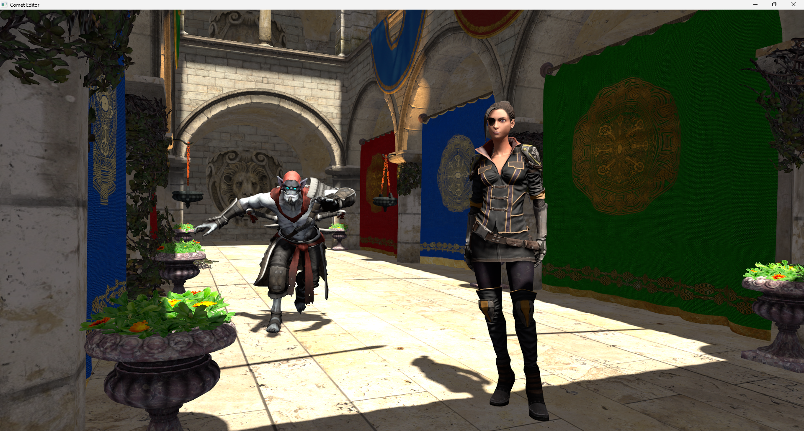
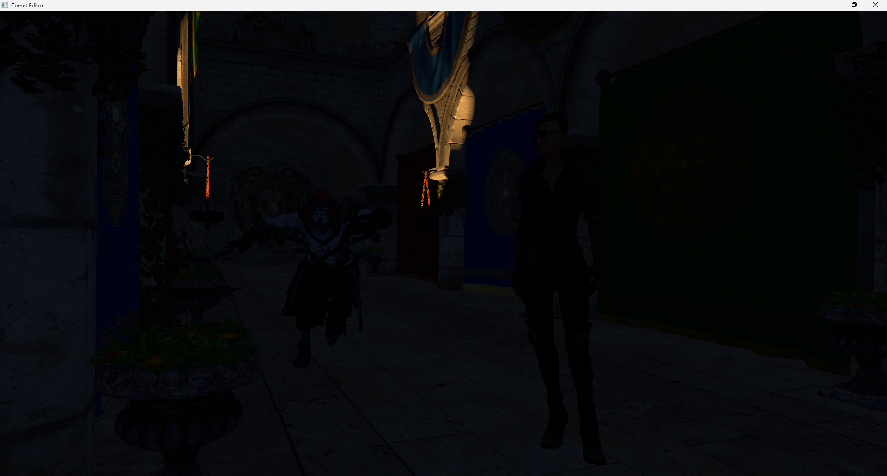
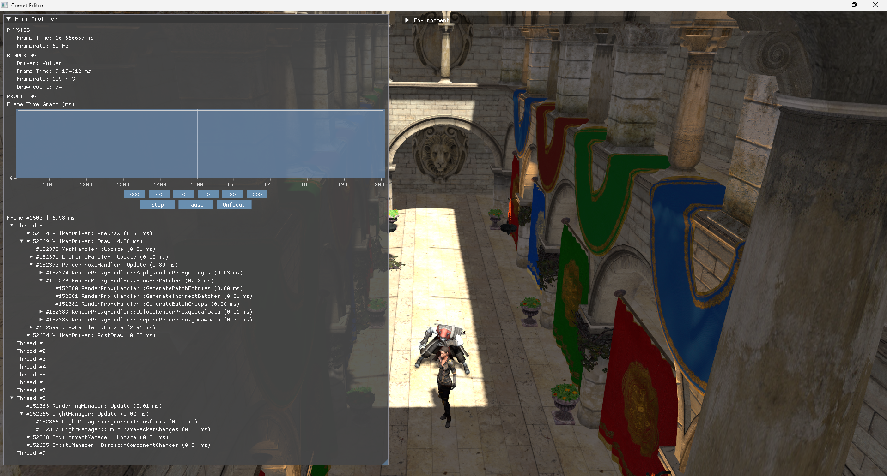
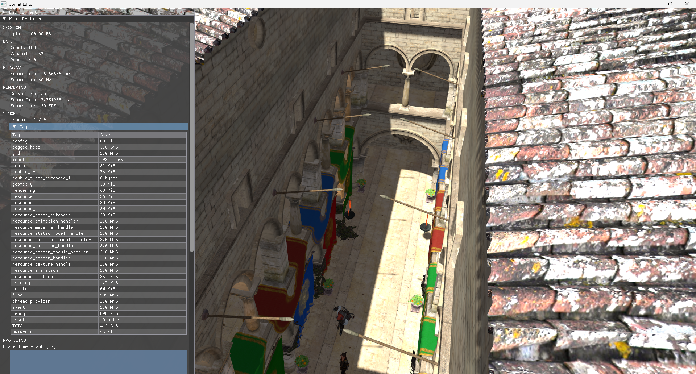

# Quick Overview

These notes summarize the main technical ideas behind **Comet**.
They're not deep documentation, just quick explanations and design generalities.

## Basic idea

**Comet** is a C++17 project following the Google Style Guide. It's a general-purpose 3D game engine built with as few external libraries as possible.
The project is split into two parts: the engine and the editor. The editor is mostly empty for now and uses a few extra libraries: it's not the focus at the moment.
Overall, the engine is still basic and experimental; it's mainly a sandbox for trying ideas rather than a finished product.

  
  

  

## Architecture

**Comet** is **frame-centric**, everything revolves around a single `FramePacket`.
Two `FramePacket`s are active at once: while one is rendered, the next is built by the main logic.
This model helps separate simulation from rendering cleanly and keeps the engine highly parallel.

## Job System & Memory

**Custom fiber-based job system**, inspired by [Naughty Dog's 2015 GDC talk](https://www.gdcvault.com/play/1022186/Parallelizing-the-Naughty-Dog-Engine).

* Fully custom fibers using small bits of x86 assembly for context switching (**MASM** on Windows, **GNU Assembler** (GAS) on GCC)
* Lock-free queue + fiber-aware synchronization (`FiberMutex`, `FiberCV`, etc.)
* Jobs:
  * `JobDescr` → CPU/fiber logic
  * `IOJobDescr` → file and I/O work
* Optional `COMET_FIBER_DEBUG_LABEL` for human-readable fiber job names
* Number of workers and thread setup configurable via `comet_config.cfg`

### Memory Management

* Custom `TaggedHeap` built on top of `VirtualAlloc` / `mmap`
* Tagged allocations make it easy to track subsystem usage
* Allocators:
  * Stack variants (regular, double-frame, fiber, etc.)
  * `FiberFreeListAllocator`
  * `PlatformAllocator` (wrapped `new`/`delete` for tagging)
* Temporary allocators for one/two-frame objects
* Optional debugging:
  * `COMET_TRACK_ALLOCATIONS` (per-tag memory usage)
  * `COMET_POISON_ALLOCATIONS` / `COMET_POISON_FIBER_STACKS`

## Rendering

Three rendering backends available:
* **Vulkan** (default)
* **OpenGL** (forces a main thread to work)
* **Empty** (debug-only, removes graphics noise)

Rendering is **data-driven** from the `FramePacket`, which isolates render data from engine logic: no locks between systems, just multiple buffered frames.

## Entities & ECS

Archetype-based **Entity Component System**.
Entities with identical component sets share contiguous memory → cache-friendly iteration.

* Components must be PODs
* Empty components can be used as tags
* Designed for stable component sets (adding/removing components is costly)

## Inputs

Input system built on **GLFW**, wrapped with **Comet**'s own types to stay backend-agnostic.
All input data is snapshotted once per frame into a read-only structure to ensure thread safety.

## Animations

Animation data comes from 3D models and supports skeletons/joints.
* Optional compression via `COMET_COMPRESS_ANIMATIONS` (enabled by default)
* Standard pose interpolation from keyframes
* Blending will come later

## Lighting & Shadows

**Comet** provides a flexible lighting system built around a central light manager, supporting multiple light types and real-time shadowing.

### Light Types

* **Directional lights** (e.g. sun)
* **Spot lights**
* **Point lights**

### Shadows

* Shadow mapping is supported for:
  * **Directional lights** (orthographic, cascade-based)
  * **Spot lights** (perspective)
* **Point light shadows (cubemaps)** are not implemented yet

### Environment & Day-Night Cycle

A lightweight **environment manager** is used to drive global lighting conditions and simulate a full day–night cycle.

It controls a primary directional light (the sun) and updates it dynamically every frame based on time progression.

#### Features

* Configurable **time of day** (in hours)
* Adjustable **day duration** and **time scaling**
* Optional **playback window** (e.g. restrict simulation to a specific time range)
* Dynamic **sun direction and intensity**
* Smooth **ambient color transitions** (night → dawn → day)
* Ability to **freeze or manually control time**

#### Runtime Control (Debug UI)

A built-in debug interface allows real-time control over all environment parameters, making it easy to iterate on lighting and shadow behavior.

* Adjust time of day interactively
* Speed up or slow down the simulation
* Tune sun behavior and lighting response
* Visualize changes instantly in the scene

  
  

  

#### Some Examples

<table align="center">
  <tr>
    <td align="center">
       
      07:00 - Morning
    </td>
    <td align="center">
       
      12:00 - Noon
    </td>
    <td align="center">
       
      22:00 - Night
    </td>
  </tr>
</table>

#### Usage

The environment manager updates:

* The main directional light (sun)
* The scene ambient color

This keeps lighting fully data-driven and consistent with the engine's frame-based architecture.

## Resources

**Assets:** raw input files (from artists/programmers *(which are also artists, don't be shy!)*).
**Resources:** engine-ready data (converted by the Editor).

* Conversion handled by the Editor
* Supported resource types: models, animations, shaders, materials, textures
* Optional **LZ4** compression

## Data Structures

Most containers accept a custom allocator implementing the `Allocator` interface.
Notable types include:
* `Array<T>` / `StaticArray<T, N>`
* `Bitset`
* `HashSet<T, HashLogic>` / `Map<Key, Value, HashLogic>`
* `StringId` (CRC32-based hashed strings)
* `TString` and `CTStringView` (UTF-8/UTF-16 aware paths)

## Events

Events derive from a base `Event` class and are dispatched via an `EventManager`.
* Can be fired immediately or next frame (preferred)
* Lifetime: two frames after dispatch
* Suitable for decoupled messaging between systems

## Configuration

Comet loads settings from a simple `comet_config.cfg` next to the executable.
Things like thread counts, renderer backend, and paths can be customized here.

## Logging

Lock-free logging system (since fibers and I/O threads can't safely sync).
* Macro format: `COMET_LOG_A_B` (e.g., `COMET_LOG_CORE_INFO`)
* Optional `COMET_LOG_USE_FIBER_PREFIX` shows which fiber/thread produced each log

## Profiling

Built-in **Dear ImGui** interface for debugging and profiling.
Requires `COMET_DEBUG` and `COMET_PROFILING`.

Modes:
* Frame metrics and CPU profiler (`COMET_IMGUI`)
* Memory tracking (`COMET_TRACK_ALLOCATIONS`)

  
  

  

  
  

  

## Notable Preprocessor Directives

| Define | Description |
|--------|-------------|
| `COMET_DEBUG` | Enables debug-only features and development tooling |
| `COMET_LOG_USE_CONTEXT_PREFIX` | Displays the caller-provided log prefix, such as Class::Method, file_name::Function, or file_name::internal::Function |
| `COMET_PROFILING` | Enables profiling instrumentation |
| `COMET_IMGUI` | Enables the Dear ImGui debug UI |
| `COMET_HAS_DEBUG_UI` | Internal derived define enabled when debug UI support is available |
| `COMET_HAS_PROFILER_DEBUG_UI` | Internal derived define for profiler UI support |
| `COMET_TRACK_ALLOCATIONS` | Tracks memory usage per memory tag |
| `COMET_POISON_ALLOCATIONS` | Fills allocated/freed memory with debug patterns |
| `COMET_POISON_FIBER_STACKS` | Fills fiber stacks with debug patterns |
| `COMET_ALLOW_CUSTOM_MEMORY_TAG_LABELS` | Allows custom labels for memory tags |
| `COMET_RESERVE_SYSTEM_THREADS` | Keeps a small number of threads reserved for the OS |
| `COMET_FIBER_DEBUG_LABEL` | Adds readable names to fiber jobs for debugging |
| `COMET_LOG_USE_FIBER_PREFIX` | Prefixes log lines with the current fiber/thread |
| `COMET_WIDE_TCHAR` | Uses wide-character paths/strings on Windows |
| `COMET_NORMALIZE_PATHS` | Normalizes file paths across platforms |
| `COMET_COMPRESS_ANIMATIONS` | Compresses animation transform data |
| `COMET_ALLOW_DISABLED_MAIN_THREAD_WORKER` | Allows disabling the main thread worker, required by the OpenGL backend |
| `COMET_RENDERING_OPENGL_CLIP_CONTROL_ZERO_TO_ONE` | Uses a `[0, 1]` depth range in OpenGL to better match Vulkan-style clip space |
| `COMET_DEBUG_RENDERING` | Enables rendering-specific debugging features |
| `COMET_RENDERING_USE_DEBUG_LABELS` | Adds GPU object labels visible in tools such as RenderDoc |
| `COMET_ENABLE_RENDERDOC_COMPATIBILITY` | Applies compatibility constraints for RenderDoc captures |
| `COMET_DEBUG_VIEW` | Enables a rendering debug view |
| `COMET_DEBUG_SHADER` | Compiles shaders with debug information and reduced optimization |
| `COMET_DEBUG_CULLING` | Enables culling debug visualization/data |
| `COMET_VALIDATION_DEBUG_PRINTF_EXT` | Enables Vulkan shader debug printf support |
| `COMET_VALIDATION_SYNCHRONIZATION_VALIDATION_EXT` | Enables Vulkan synchronization validation |
